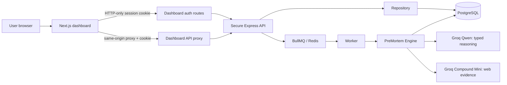

# Unified PreMortem Dashboard — Current Structure and Code Guide

**Current source of truth:** `dashboard/` is the user-facing product. It uses `secure-backend/` for the protected agent workflow. The separate `premortem-agent-map` project is now only a visual architecture explainer; it does not run the live product.

> The live product is not a frontend-only diagram. It is a protected dashboard where users sign in, choose a project, submit a plan, inspect two independent evidence branches, approve a mock action, and verify or replan it.

## 1. System structure



The browser does **not** receive the Groq key, backend URL, JWT token, model choice, prompt, evidence policy, or risk-scoring policy. It communicates with the dashboard on the same origin only.

## 2. Repository layout

```text
pre_mortem/
├── dashboard/                         # Real user-facing product (Next.js)
│   ├── app/
│   │   ├── page.tsx                    # Unified live Agent Map + workspace
│   │   ├── agent-map/page.tsx          # Simple "how the agent works" page
│   │   └── api/
│   │       ├── auth/                   # Register, login, session, logout
│   │       └── backend/[...path]/      # Strict same-origin backend proxy
│   ├── src/
│   │   ├── components/
│   │   │   ├── AccessPanel.tsx         # Sign-in and create-workspace UI
│   │   │   └── ProjectHub.tsx          # Project picker, create, rename, history
│   │   └── lib/
│   │       ├── api.ts                  # Browser-safe API client
│   │       ├── contracts.ts            # Zod response schemas/types
│   │       ├── demo.ts                 # Clearly labelled example dossier
│   │       ├── matrix.ts               # Deterministic matrix display logic
│   │       └── server-auth.ts          # HTTP-only cookie helpers (server only)
│   └── app/globals.css                 # Case-file visual system and responsive UI
│
├── secure-backend/                     # Protected Node.js / Express agent backend
│   ├── migrations/
│   │   ├── 001_initial.sql             # Organizations, projects, analyses, evidence
│   │   ├── 002_agentic_mvp.sql         # Agent trace, critic, mock actions
│   │   └── 003_self_service_product.sql# User credentials and history index
│   ├── scripts/
│   │   ├── issue-local-token.mjs        # Local-only development token helper
│   │   └── verify-groq-pipeline.mjs     # Local-only safe provider/live-run verifier
│   └── src/
│       ├── app.ts                      # Express middleware, headers, redacted logs
│       ├── routes.ts                   # Narrow typed public API routes
│       ├── identity.ts                 # JWT issuance and verification
│       ├── repository.ts               # PostgreSQL persistence and tenant checks
│       ├── engine.ts                   # Full PreMortem agent orchestration
│       ├── evidence.ts                 # Trusted-source-first evidence policy
│       ├── groq.ts                     # Server-only Groq client and JSON recovery
│       ├── prompts.ts                  # Server-owned prompts
│       ├── contracts.ts                # Zod input/output contracts
│       ├── queue.ts                    # BullMQ dispatch
│       ├── worker.ts                   # Durable background analysis worker
│       └── rateLimit.ts                # Analysis and authentication limits
│
├── SECURITY_AUDIT.md
├── tier-one-source-research.md
└── todo.md
```

## 3. What happens when a user uses the product

| Step | User experience | Main code path |
|---:|---|---|
| 1 | Creates a workspace or signs in | `dashboard/src/components/AccessPanel.tsx` → `dashboard/app/api/auth/*` → `secure-backend/src/routes.ts` |
| 2 | Receives a secure server session | `secure-backend/src/identity.ts` issues a short-lived JWT; `dashboard/src/lib/server-auth.ts` stores it only in an HTTP-only cookie |
| 3 | Creates/selects/renames a project | `ProjectHub.tsx` → `dashboard/src/lib/api.ts` → proxy → `Repository.createProject`, `listProjects`, `renameProject` |
| 4 | Submits a plan | `DashboardPage.runAnalysis()` → `POST /v1/analyses` → `Repository.createOrReuseRun()` → BullMQ queue |
| 5 | Agent performs the pre-mortem | `worker.ts` → `engine.ts` → planner → research A/B → scenario A/B → comparator → critic → synthesis |
| 6 | Dashboard shows updates | `DashboardPage.poll()` loads `GET /v1/analyses/:id`; saved active runs reopen from project history after refresh |
| 7 | User submits mitigation proof | `POST /v1/risks/:id/mitigations` → deterministic score update plus stored model rationale |
| 8 | User approves and verifies a mock action | `POST /v1/risks/:id/actions` then `POST /v1/actions/:id/verification`; failed verification creates a replan trace event |

## 4. Unified dashboard UI

`dashboard/app/page.tsx` is the main product page. It has five connected sections at the top:

1. **Scope** links to the project plan input.
2. **Investigate** links to the visible two-branch agent trace.
3. **Challenge** links to the evidence critic finding and gaps.
4. **Decide** links to the evidence-backed risk register.
5. **Verify** links to human approval, mock action, verification, and replan.

The page starts with `AccessPanel` if there is no session. Once signed in, it shows `ProjectHub`, then the live Agent Map and the running workspace. This is why the visual Agent Map is now part of the real product rather than a disconnected diagram.

## 5. Key code boundaries

### Dashboard browser code

The browser can call only dashboard-relative paths. For example, `dashboard/src/lib/api.ts` sends requests like:

```ts
fetch(`/api/backend/v1/projects/${projectId}/analyses`)
```

It never handles an access token. The Next.js server reads the cookie and adds the backend authorization header.

### Dashboard server routes

`dashboard/app/api/auth/login/route.ts` and `register/route.ts` forward credentials to the secure backend, take the returned internal JWT, then set an HTTP-only cookie. The JSON returned to the browser contains user and organization information only.

`dashboard/app/api/backend/[...path]/route.ts` is an allowlist, not an open proxy. It accepts only analysis, project, history, mitigation, mock-action, and verification paths.

### Backend security boundary

`secure-backend/src/routes.ts` accepts narrowly typed Zod inputs. The browser cannot submit provider model names, prompts, evidence objects, risk scores, token budgets, or search settings.

`secure-backend/src/identity.ts` verifies every protected request includes a signed JWT with:

```json
{
  "sub": "user UUID",
  "org_id": "organization UUID",
  "role": "admin or member"
}
```

`secure-backend/src/repository.ts` checks the actor belongs to the project organization before it exposes or mutates project, analysis, risk, or action data.

## 6. Agent workflow code

`secure-backend/src/engine.ts` is the orchestration center. Its safe order is:

```text
Normalize plan
  → Create investigation plan
  → Research branch A
  → Research branch B
  → Form scenario A
  → Form scenario B
  → Compare the branches
  → Critique evidence quality
  → Synthesize ranked risks
  → Persist the result and trace
```

The engine uses Qwen for typed reasoning and Compound Mini only for web search. Every displayed claim/risk must refer to a retained evidence ID. The source policy in `evidence.ts` selects trusted domains first and the critic checks Tier-1 coverage for each branch independently.

The Groq client in `groq.ts` uses bounded recovery: strict JSON schema where appropriate, JSON-object mode for compact steps, removal of accidental prose framing, one constrained regeneration, and one bounded schema repair. If recovery still fails, it records an explicit `attention` fallback instead of making up evidence. The latest live validation completed with no fallback stages.

## 7. Database records

| Record group | Tables |
|---|---|
| Workspace identity | `organizations`, `users`, `user_credentials`, `memberships` |
| Projects and runs | `projects`, `analysis_runs`, `investigation_plans` |
| Research and reasoning | `evidence_sources`, `branch_runs`, `disagreement_records`, `critic_records`, `agent_trace_events` |
| Decisions and follow-through | `risk_items`, `risk_evidence`, `mitigation_assessments`, `mock_actions`, `audit_events` |

`003_self_service_product.sql` must be applied after the earlier two migrations. It adds the password credential table, user display name, and an index for project/status/history queries.

## 8. Main commands

```bash
# Secure backend
cd secure-backend
pnpm check && pnpm test && pnpm build
pnpm verify:groq -- --full    # local only; uses a local key and never prints it

# Dashboard
cd dashboard
pnpm check && pnpm test && pnpm build
```

For a local full product run, start the API and worker separately, then start the dashboard with its server-only `PREMORTEM_API_URL` configuration. In production, use HTTPS for the dashboard-to-backend connection and apply all three database migrations.

## 9. Current state

The unified dashboard build, its tests, and the secure backend build all pass. The current product has real sign-in/bootstrap, project management, durable history/resume, evidence-backed analysis, a visible agent trace, human approval, and a safe mock-action verification loop.

The remaining production-scale work is outside this guide: verified email/password reset or external SSO, multi-factor authentication, operational monitoring, deployment infrastructure, and optional approved actions in tools such as GitHub or Jira.
